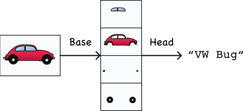
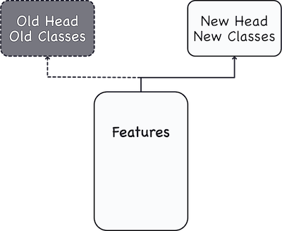

# Capstone Project: Age-Classfication Image Analysis

## 1. Problem Statement

Deep Learning is the foundation through which many breakthroughs are founded upon. One of it's biggest applications is in image anaylysis. Deep Learning has enabled many popular commercial features such as [Face ID](https://towardsdatascience.com/how-i-implemented-iphone-xs-faceid-using-deep-learning-in-python-d5dbaa128e1d) in the current iPhones, [portrait photography](https://ai.googleblog.com/2020/12/portrait-light-enhancing-portrait.html), and so on.

For this project, we will be looking into a simpler task: by using Deep Learning, we will train a model to identify the age of a person simply by analysing an image of their face.
This model can be applied to tackle many different tasks, such as:

- Sorting through a large collection of Family photos
- Analysing customer demographic of businesses (cafes/restaurants, tourist avenues)
- Health and Fitness tracking

## 2. Datasets

In order to train our model, we will need a large dataset of facial images that have been tagged with their respective ages. Thankfully, there exists a widely used dataset called [UTKFace](https://susanqq.github.io/UTKFace/), which is am extensive face dataset with images of people ranging from 1 to 116 years old. It consists of 20 0000 images, with their [corresponding details](https://www.kaggle.com/nipunarora8/age-gender-and-ethnicity-face-data-csv) of age, gender, and ethnicity noted as well.

## 3. Exploratory Data Analysis

We will first look through and analyse data to look for any missing/incomplete data points, as well as any outliers or imbalanced distributions.

### 3.1 Grouping up the Images

For this project, our approach for identifying age is through Classification. We will be grouping the images into discrete age groups, and then attempt to train the model to classify images correctly.

The age groups and age-ranges will be as follows:

- Baby:  1
- Toddler:  2 - 3
- Child:  4 - 8
- Adolescent:  9 - 13
- Teen:  14 - 18
- Young Adult:  19 - 24
- Adult: 25 - 34
- Mature: 35 - 44
- Middle Age: 45 - 59
- Senior: 60 - 74

### 3.2 Data Cleaning

Our initial analysis revelals some imbalances in the dataset. Specifically, the number of images in the age groups vary greatly: Adults form 32% of the images, while Adolescents take up only 2.6%. This is a difference of 12.3 times; more than an order of magnitude.
Ethnic distribution is very imbalanced as well, as pointed our earlier.

We then attempt to reduce the imbalances in both areas. After this Data cleaning process, the dataset is still not well-balanced but we have reduced the imbalance quite significantly. For example, now adults take up only 19.6% of the dataset, and Adolescents take up 3.3%. This is much improved compared to previously.

### 3.3 Feature Engineering

Our age-groups will be our target-variable in our modelling later, but we will change it to ordinal labels for better evaluation.

## 4. Modelling

We will be trying out a few models to see which works best.

1. Model built from Scratch
2. Pre-trained CNN (Mobilenet)
3. Pre-trained CNN (VggFace)

### 4.1 Model built from Scratch

As expected, the model built from scratch did not perform very well, with an accuracy score of 39%.

### 4.2 Pre-trained Model (MobileNet V2)

Next we created a model by using a Pre-trained Convolutional Neural Netowork (CNN).

The first base model is from the MobileNet V2 model developed at Google. This is a model that was pre-trained on the ImageNet dataset, an extensive dataset consisting of 1 400 000 images and 1000 classes. While the model is trained to classify different objects like Jackfruit and Syringe, we can use just the CNN as a generic "feature extractor".

We will then attach a Classification "Head" on top of the CNN, which will then figure out predictions based on our specific Dataset.

A useful way to think about this process is from these two images:   

    

*Credits to [Kaggle](https://www.kaggle.com/ryanholbrook/the-convolutional-classifier) for the two images*

We attained a much better score by using a Pre-Trained Convolutional base. However, 44% is not yet satisfactory.

### 4.3 Pre-trained Model (VggFace)

The [VggFace](https://www.robots.ox.ac.uk/~vgg/software/vgg_face/) model is trained for Facial Recognition; it is able to identify different faces with 92.8% to 99.1% accuracy.

While our task of age-detection is differen from face recognition, we can still use the Convolutional Base of this model, as it has been trained to extract facial features.

Of the three models we have used, the one with VggFace as the Base CNN performs the best, with an accuracy score of 54%. This is expected as VggFace is specifically trained for facial features.

### 4.4 Evaluation of Misclassified Images

A few trends that can be seen in the misclassified images are:

1. Blur image quality. While all images are 200 X 200 pixels, there are some of them with really poor resolution and quality. This seems to be the biggest factor in misclassification

2. Makeup on women. Depending on the age-group, women and girls with makeup on tend to be classified into a higher age-group.

3. Toddlers and babies. Since babies are classified as 1 year olds only, while toddlers are classified as 2-3 years old. Due to the short gap between the two classes, we do see a lot of misclassification happening even on high-quality images.

## 5. Conclusions & Recommendations

### 5.1 Conclusions

The model can be considered a moderate success as it is able to classify 94% of images up to 1-class accuracy. This is expected as the age groups are continuous integers, and hence images of people who are near the boundaries of the age-ranges will tend to be misclassified.

However, if we look at the exact accuracy score of 54%, there is definitely room for improvement.

### 5.2 Future Improvements

1. **Fine-tune model further**. We can try varying the number of layers we unfroze in the CNN-base to better adapt the model to the dataset. There are also other Pre-Trained Convolutional Networks we could try and adapt to this model.

2. **Carry out a more thorough Data Cleaning process.** As we have seen in the evaluation, there are quite a lot of photos with poor image quality. A more thorough data cleaning process could improve the data pipeline, thereby improving the model performance as well.

3. **Look for more Data.** We have found that there is quite a lot of imbalance in the dataset. We tried to reduce it by removing some images; but that means loss of data. If we could instead look for more images to increase the images that have a lower proportion, that would result in a more robust and extensive dataset.

### 5.3 What's next?

This model on its own is not quite ready for deployment. Images need to be cropped before analysis, which can be a tedious process. If we pair this model with an effective face-segmentation model, that will allow us to identify multiple faces in a single image, and give predictions to each of them.

Our model is also trained only for ages 1-74. With more data and better computing resources, this model can be expanded to cover age ranges up to 99 years old.
